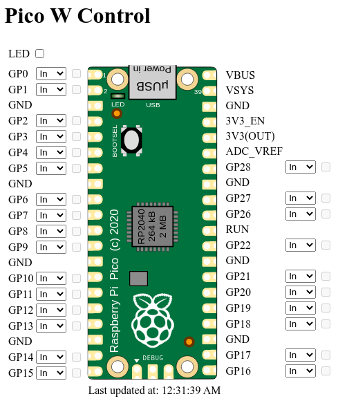

# Raspberry Pi Pico W Web Control

A simple web-based UI for controlling digital io pins on the Pico W built with [CircuitPython](https://github.com/adafruit/circuitpython).



## Usage

1. Install CircuitPython on your Pico W. In order to use wifi (required for this project), you will need to install the latest 8.0.0 beta.

2. Copy the following files to the pico's flash storage:

   - adafruit_httpserver.py
   - rpiserver.py (rename to code.py or main.py)
   - pins.py
   - pico.svg
   - index.html

3. Create a secrets.py file on the pico that looks like:

```.py
# secrets.py

secrets = {
    'WIFI_SSID': 'my_ssid',
    'WIFI_PASSWORD': 'my_password',
}
```

4. Open a web browser pointed to the ip address of the pi to view the control ui.

## Limitations

- Only handles gpio pins - no analog, spi, i2c, etc.
- Requires a modified version of adafruit_httpserver.py (included in this repo) to support reading the content of POST requests.
- Currently requires using CircuitPython beta as wifi support for the pico w isn't present in a stable release yet.
- Only works on the pico w, although it wouldn't be hard to port this to other devices supported by CircuitPython.

## Hacking

For development purposes, the `fakeserver.py` program implements the same http interface as the "real" `rpiserver.py`, but runs on non-raspberry-pi devices. It emulates the pins on the pi and is useful for testing out the frontend code.

## License

Two files in this repo are not mine:

- adafruit_httpserver.py - borrowed (with some modifications) from https://github.com/adafruit/Adafruit_CircuitPython_HTTPServer
- pico.svg - borrowed from https://upload.wikimedia.org/wikipedia/commons/9/92/RaspberryPi_Pico.svg

Everything else is MIT licensed
